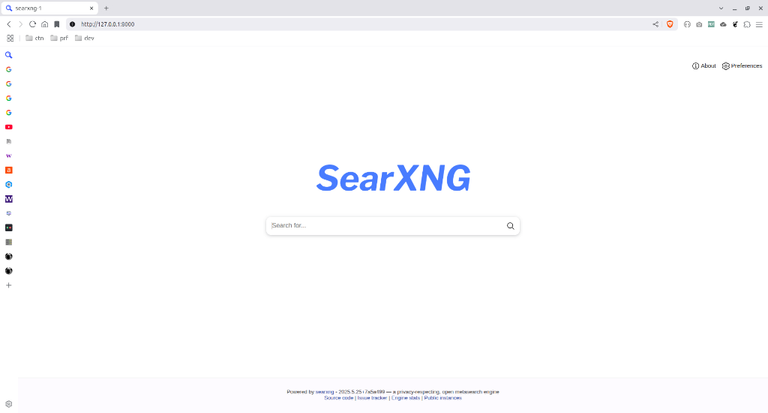

# Cara Membuat Search Engine Pribadi dengan SearXNG

Siapa yang tidak ingin punya search engine pribadi?

Apalagi biaya software-nya murah bahkan bisa gratis.

Kalaupun kita ingin menginstallnya di raspberry pi sekalipun, harga hardware-nya tergolong murah.

Hanya ingin diinstall di komputer lokal? Bisa.

Apa nama dari software search engine pribadi ini?

Jawabannya adalah: SearXNG.

Anda bisa lihat website dan dokumentasinya di sini:

https://docs.searxng.org/ 

Jika Anda tidak punya waktu membacanya, di sini saya berikan cara install-nya.

## Cara Install SearXNG

Jika Anda belum install Docker, install saja dahulu di komputer lokal. Menurut saya ini cara yang paling mudah.

Karena Docker diinstall di komputer lokal dan diakses dari komputer itu juga, maka ip untuk mengakses container-nya adalah 127.0.0.1

IP ini akan dimasukkan ke argument perintah docker run nantinya.

Setelah menginstall Docker, buka command prompt di folder yang baru Anda buat (namanya bebas), kemudian jalankan perintah ini:

```
docker run -it -d --name="searxng" -p 7000:8080 -v "./data:/etc/searxng" -e "BASE_URL=http://127.0.0.1:7000/" -e "INSTANCE_NAME=searxng-1" searxng/searxng
```

Dalam perintah tersebut:

- ip address searxng Anda adalah 127.0.0.1
- port searxng Anda adalah 7000
- jadi, url searxng Anda adalah http://127.0.0.1:7000

Sekarang buka url tadi dengan web browser Anda.

<p align="center">
    
</p>



Jika berhasil, maka Anda siap untuk melakukan searching.

Anda bisa mengganti port-nya dengan nomor lain, tapi pastikan port itu tidak sedang digunakan.

Caranya, ganti 7000 dengan angka lain seperti 8080 atau 8000 dan lain-lain.

## Penutup

Sekian.