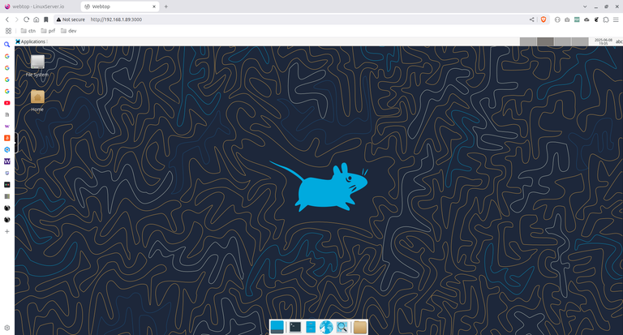
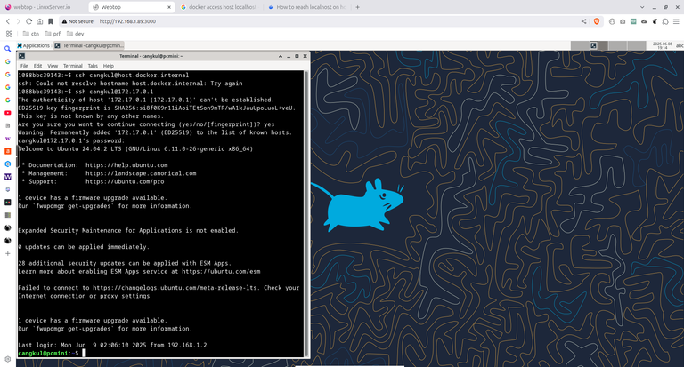
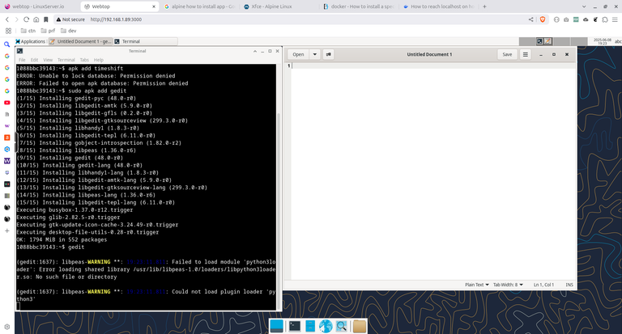

# WebTop - Distro Linux dalam Container untuk Web Browser

Mengakses distro linux dari web browser sekarang sudah bisa dilakukan...

Webtop, aplikasi self hosted berbasis web ini merupakan linux dengan beberapa pilihan distro yang bisa diakses dari browser anda.

Namun, untuk menginstallnya Anda memerlukan docker.

Jadi, jika Anda belum menginstallnya, lakukan saja sekarang.

## Kesan Pertama

Saat saya menjalankan docker compose ini di salah satu mini pc server saya via SSH ke mini pc server saya:

```bash
ssh username-mini-pc-server-saya@ip-mini-pc-saya
```

```bash
nano docker-compose.yml
```

Kemudian mengisi script di bawah kemudian save:

```yaml
---
services:
  webtop:
    image: lscr.io/linuxserver/webtop:latest
    container_name: webtop
    security_opt:
      - seccomp:unconfined #optional
    environment:
      - PUID=1000
      - PGID=1000
      - TZ=Etc/UTC
      - SUBFOLDER=/ #optional
      - TITLE=Webtop #optional
    volumes:
    - ./data:/config
      - /var/run/docker.sock:/var/run/docker.sock #optional
    ports:
      - 3000:3000
      - 3001:3001
    devices:
      - /dev/dri:/dev/dri #optional
    shm_size: "1gb" #optional
    restart: unless-stopped
```

Kemudian melanjutkan dengan:

```bash
docker compose up -d
```

Lalu membuka http://ip-mini-pc-server-saya:3000, saya merasakan performanya yang cukup bagus.

Dengan tampilan sekompleks itu, webtop bisa dibuka dan dijalankan cukup cepat, meskipun via browser.



Karena di docker compose tadi saya memilih versi latest, maka pada saat artikel ini ditulis, linux ini adalah Alpine XFCE (tiap tag berbeda jenis linux-nya. silakan cek di [dokumentasinya](https://docs.linuxserver.io/images/docker-webtop/)).

## Tidak Mengekspos Host secara Default

Server saya tadi, yang berupa mini pc, menggunakan Ubuntu 24.04 dan beberapa aplikasi telah terinstall di sana. Karena Webtop diinstall di dalam docker container, saya tidak bisa mengakses aplikasinya secara langsung dari Webtop.

Mungkin, bagi pengguna Windows bisa dianalogikan seperti guest VMWare atau VirtualBox yang mengakses sistem operasi host-nya.

> Catatan: Perlu diketahui bahwa yang dimaksud dengan sistem operasi host adalah sistem operasi yang diinstall docker, yakni mini pc server saya, sedangkan sistem operasi guest adalah sistem operasi yang berjalan dalam docker container tadi. Saya tidak tahu apakah istilah ini tepat untuk docker, tapi setidaknya saya meminjam istilah tersebut untuk menjelaskan artikel ini kepada Anda.

Namun, mungkin saja kita bisa melakukan SSH ke host dari docker container sehingga kita jadi bisa mengakses aplikasi milik host tadi.

Jadi, saya coba akses username-mini-pc-server-saya@172.17.0.1 via SSH:

```bash
ssh username-mini-pc-server-saya@172.17.0.1

# 172.17.0.1 adalah ip mini pc server saya dari sudut pandang container.
```



Ternyata berhasil.

## Ada Gunanya

Bagi saya yang berkali-kali gagal menginstall VNC server di Ubuntu 24.04 (host saya tadi atau mini pc server saya), aplikasi ini sangat berguna.

Saya jadi bisa melakukan SSH seperti tadi, dan bahkan mungkin melakukan hal lain dengannya, karena aplikasi ini juga memungkinkan untuk diinstallkan aplikasi.

Di Webtop, saya coba install gedit dan berhasil. Anda bisa lihat window gedit ada di sebelah terminal:



## Akhir Kata

Sebelumnya saya tidak menyangka bahwa ada aplikasi semacam ini.

Tapi apa boleh buat, karena bisa dilakukan, akhirnya saya coba juga.