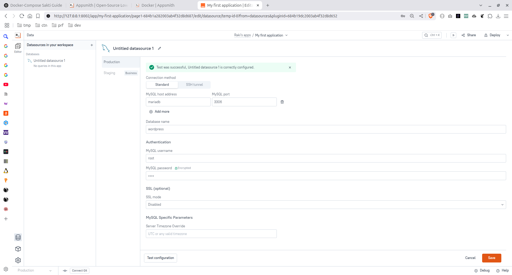

# Bikin Docker Compose Sakti untuk Web Developers


Saat itu masih dini hari. Saya teringat bahwa saya harus menginstall aplikasi bernama AppSmith karena saya sangat penasaran dengan Low Code.

Istilah Low Code dan No Code sudah saya dengar beberapa waktu yang lalu, namun baru malam itu saya benar-benar ingin merasakannya.

Saya buka website resminya, langsung ke [dokumentasinya](https://docs.appsmith.com).

Tidak terlalu sulit rupanya, hanya beberapa baris kode docker-compose seperti ini:

```yaml
version: "3"
services:
   appsmith:
     image: index.docker.io/appsmith/appsmith-ee
     container_name: appsmith
     ports:
         - "80:80"
         - "443:443"
     volumes:
         - ./stacks:/appsmith-stacks
     restart: unless-stopped
```

Seperti biasa, saya ubah portnya menjadi sesuatu yang lain dari 80. Begitu juga port 443-nya.

Pulling... pulling... extracting... Beres.

Langsung menuju localhost dan jebret!! AppSmith siap digunakan.

Di window awalnya, saya meregistrasi email dan password saya, kemudian login.

Window selanjutnya, AppSmith mempertanyakan apakah saya ingin menghubungkannya dengan database tertentu. Saya pilih skip saja.

Karena di awal telah dibuatkan project default secara otomatis, saya mengeksplorasinya dan sampai pada pojok kiri bawah saya menemukan tombol untuk mengoneksikan database.

Karena saya telah menginstall WordPress secara non-docker, serta MariaDB dan phpMyAdmin secara docker, saya ingin mencoba untuk mengoneksikan MariaDB tadi.

Dan disinilah masalah dimulai...

Saya coba masukkan host: 127.0.0.1, port: 3306, dan sisanya termasuk username dan password. Ternyata tidak bisa terkoneksi.

Saya coba lagi masukkan host: 172.17.0.1 karena itu adalah alamat dari sistem operasi Ubuntu saya dalam sudut pandang container. Tidak bisa juga.

Beragam cara telah dicoba, tapi gagal.

Akhirnya, saya menyimpulkan bahwa ini mungkin disebabkan parameter --bind-address yang bukan 0.0.0.0, tapi saya tidak ingin memperpanjang masalah.

Saya langsung ambil suatu langkah yang ekstrim.

Idenya adalah Bagaimana jika saya satukan saja docker-compose dari MariaDB, phpMyAdmin, dan AppSmith.

Dasar pemikiran tersebut adalah, jika phpMyAdmin dan MariaDB yang berada dalam satu docker-compose bisa terkoneksi tanpa masalah, berarti AppSmith juga.

Tapi, karena merasa tidak ingin mengulang-ulang langkah serupa, saya sertakan juga WordPress dan Node-Red ke dalamnya.

Yang ujungnya, hasil docker-compose.yml saya seperti ini:

```yaml
version: '3'

services:
  mariadb:
    image: mariadb:latest
    restart: always
    environment:
      MYSQL_ROOT_PASSWORD: root
      MYSQL_DATABASE: wordpress
      MYSQL_USER: user
      MYSQL_PASSWORD: user
    ports:
      - "3306:3306"
    volumes:
      - ./mariadb:/var/lib/mysql

  phpmyadmin:
    image: phpmyadmin/phpmyadmin
    restart: always
    environment:
      PMA_HOST: mariadb
      PMA_USER: root
      PMA_PASSWORD: root
    ports:
      - "8001:80"
    depends_on:
      - mariadb
      
  appsmith:
     image: index.docker.io/appsmith/appsmith-ce
     container_name: appsmith
     ports:
         - "8002:80"
         - "8003:443"
     volumes:
         - ./appsmith-stacks:/appsmith-stacks
     restart: unless-stopped
     depends_on:
       - mariadb
      
  wordpress:
    image: wordpress
    container_name: wordpress
    restart: unless-stopped
    ports:
        - 8004:80
    environment:
      WORDPRESS_DB_HOST: mariadb:3306
      WORDPRESS_DB_USER: root
      WORDPRESS_DB_PASSWORD: root
      WORDPRESS_DB_NAME: wordpress
    volumes:
      - ./wordpress:/var/www/html
    depends_on:
      - mariadb
      
  node-red:
    image: nodered/node-red:4.0.9
    container_name: node-red
    restart: unless-stopped
    ports:
        - 8012:1880
    volumes:
      - ./node_red:/data
    depends_on:
      - mariadb
```

Yang perlu Anda perhatikan pada docker-compose tadi adalah:

-   semua services selain mariadb memiliki depends\_on: mariadb
-   beberapa services memiliki volume yang di-mount ke folder tertentu, seperti ./wordpress:/var/www/html. salah satu alasannya adalah agar saya bisa mengeditnya nanti.
-   beberapa port mungkin perlu Anda ganti jika sudah terpakai.

Jika Anda ingin mencobanya, masukkan saja docker-compose.yml tadi ke suatu folder, buka terminal di sana dan jalankan:

```bash
docker compose up -d
```

Setelah container berjalan, Anda bisa mengoneksikan MariaDB dari AppSmith Anda seperti screenshot ini:



Adapun phpMyAdmin otomatis membacanya.

Dalam kasus ini, WordPress jika dibuka alamatnya akan menuju ke halaman penginstallan. Untuk mengisi detailnya serupa dengan AppSmith tadi.

Yang jelas, di WordPress, Anda harus membuatkan 1 database dulu via phpMyAdmin, sedangkan di AppSmith, jika Anda mau Anda bisa menggunakan database WordPress yang sudah jadi atau buat baru lagi.

Dalam hal Node-Red, saya belum tahu cara mengoneksikannya ke MariaDB, jadi skip saja...

Setelah saya lakukan hal tadi, saya jadi menghemat waktu, kopi, dan pikiran saya.

Lumayan.