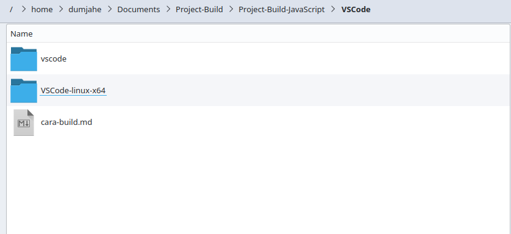
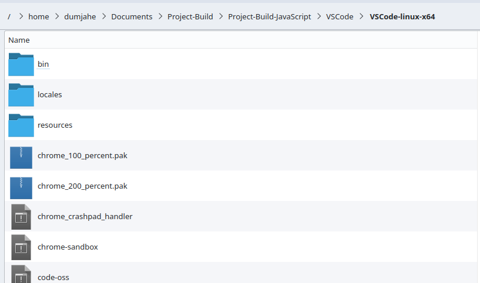

# Cara Build VSCode dari Source Code dengan Target Linux

Siapa yang tidak kenal [VSCode](https://github.com/microsoft/vscode)? Text editor ini serbaguna karena dapat digunakan sebagai code editor untuk banyak bahasa pemrograman. Bahkan saya menggunakan fork-nya untuk note taking.

Karena text editor ini cukup menarik untuk diutak-atik, saya memutuskan untuk mencoba membuild-nya dari source code di Linux.

Tapi, kenapa Linux? Sebenarnya, saya melakukan itu karena saya menggunakan Linux dengan distro Kubuntu di versi 24.04.3.

Sebenarnya, kita bisa membuild-nya di Windows, tapi caranya beda. Jadi, jika Anda ingin mempelajari build-nya di Windows, silakan cek [di halaman ini](https://github.com/microsoft/vscode/wiki/How-to-Contribute).

## Persiapan

Berdasarkan [link tadi](https://github.com/microsoft/vscode/wiki/How-to-Contribute), yang berlaku juga untuk Linux, saya mendapati error jika saya menggunakan Node.js versi 20.x. Jadi, gunakan versi 22.x.

Saya sangat menyarankan untuk menggunakan nvm agar switching antar versi lebih mudah. Anda bisa menginstallnya dengan cara yang diberikan oleh [repository resminya ini](https://github.com/nvm-sh/nvm).

OK, karena saya anggap Anda menggunakan nvm, maka lakukan ini:

```bash
nvm install 22

nvm alias default 22

# kemudian tutup terminal, lalu buka lagi
```

Selain itu, Anda juga butuh Python dan saya juga sangat menyarankan untuk gunakan pyenv agar switching antar versi lebih mudah. Anda bisa menginstallnya dengan cara yang diberikan oleh [repository resminya ini](https://github.com/pyenv/pyenv).

OK, karena saya anggap Anda menggunakan pyenv, maka lakukan ini:

```bash
pyenv install 3.11.13

pyenv global 3.11.13
```

Sekarang, cek ulang keduanya:

```bash
python --version
# harus 3.11.13

node -v
# harus 22.x
```

## Menginstall Dependencies pada Sistem Operasi

Selain itu, Anda juga harus menginstall dependencies lainnya dengan sudo apt-get install:

```bash
sudo apt-get install build-essential g++ libx11-dev libxkbfile-dev libsecret-1-dev libkrb5-dev
```

Saya skip "python-is-python3" karena saya kira itu tidak perlu dan setelah saya coba ternyata benar juga. Mungkin karena saya pakai pyenv tadi.

## Melakukan git clone

Untuk mendapatkan kode VSCode, lakukan cara ini:

```bash
git clone https://github.com/microsoft/vscode.git
```

Lalu masuk ke folder vscode:

```bash
cd vscode
```

## Melakukan npm install

Selanjutnya, download dependencies dari vscode dengan npm install:

```bash
npm install
```

Ini akan sedikit lama, jadi harap tunggu.

## Jika Berhasil

Jika npm install berhasil, maka kita tinggal membuat package-nya untuk Linux.

Caranya:

```bash
npm run gulp vscode-linux-x64
```

Hasilnya, jika berhasil, ada di folder parent dari vscode ("../vscode").

Nama foldernya adalah "VSCode-linux-x64".

## Selesai

Inilah hasilnya:



