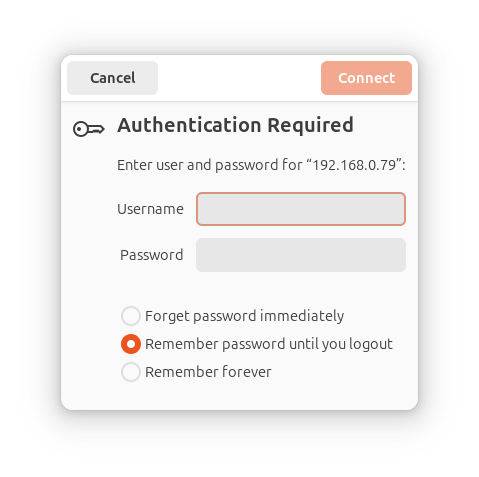

# Cara Manajemen File Remote dengan Nautilus

Menemukan FTP client untuk Ubuntu yang cocok untuk saya sedikit sulit.

Tidak banyak pilihan yang sesuai dengan keinginan saya.

Padahal, saya memerlukan aplikasi semacam itu mengingat saya memiliki beberapa server di rumah.

FileZilla mungkin bisa menjadi pilihan, tapi saya merasa ada yang kurang dengan perilaku user interface-nya.

Di Windows, dulu saya bisa menggunakan WinSCP tapi kalaupun itu bisa dijalankan di Ubuntu, mungkin saya perlu Wine.

Akhirnya, saya memutuskan untuk menggunakan fitur bawaan dari file explorer Ubuntu yang bernama Nautilus.

Fitur tersebut bisa Anda akses jika Anda mengklik address bar di bagian atas dari Nautilus.

Setelah bagian tersebut disorot, Anda bisa memasukkan:

ssh://ip-address-target

Nanti, akan muncul dialog box untuk memasukkan username dan passwordnya.



Selanjutnya, Anda bisa memanage file remote Anda di Nautilus itu juga.

Perlu diketahui juga bahwa mungkin, jika anda memilih "Remember Forever", Anda akan bingung bagaimana menghapus password-nya.

Untuk menghapus password tersebut Anda cukup jalankan perintah ini di terminal:

```bash
seahorse
```

Nanti Anda bisa menghapus entri dari password yang telah diingat sebelumnya.