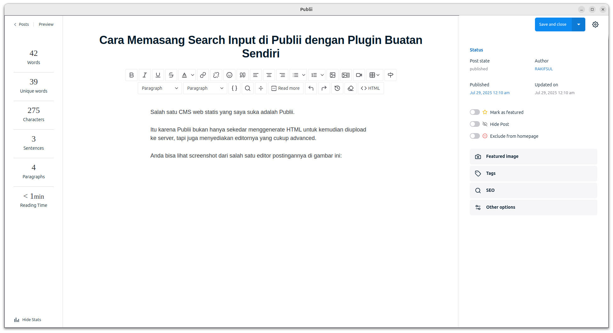
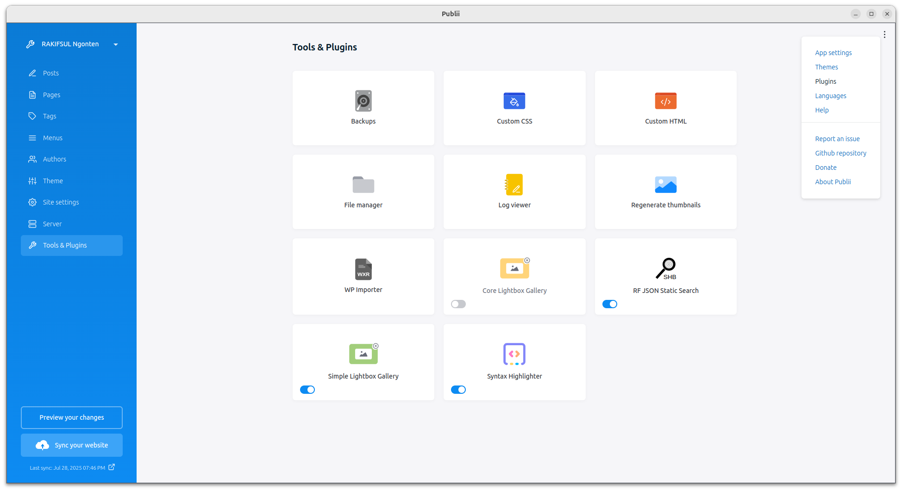
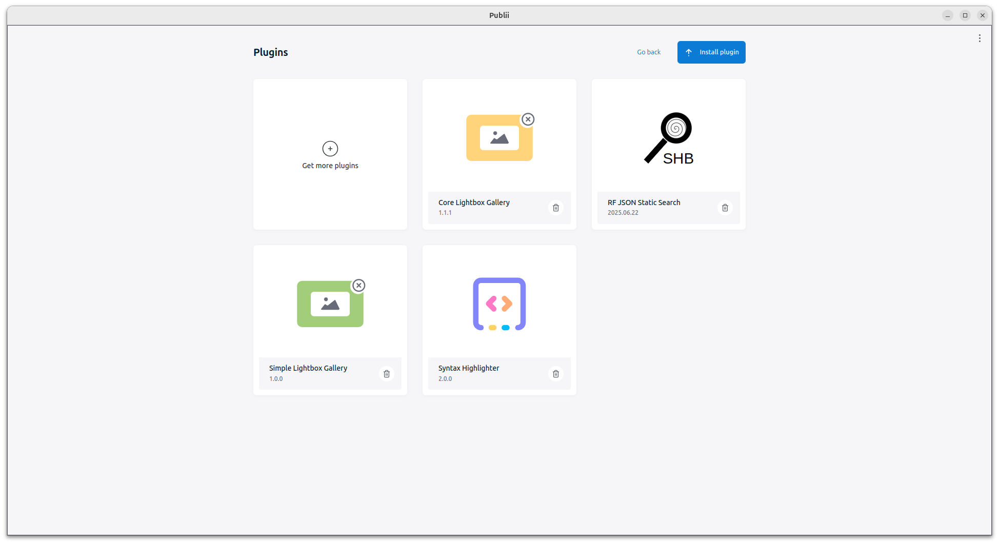
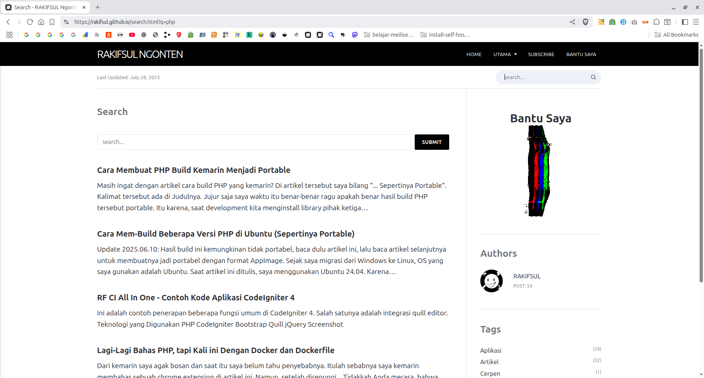

# Cara Memasang Search Input di Publii dengan Plugin Buatan Sendiri

**Update 2025.07.31-0520:** **Untuk script js-search, bisa didapatkan [di link ini](https://unpkg.com/js-search@1.3.7/dist/umd/js-search.min.js).**

Salah satu CMS web statis yang saya suka adalah [Publii](https://github.com/GetPublii/Publii).

Itu karena Publii bukan hanya sekedar menggenerate HTML untuk kemudian diupload ke server, tapi juga menyediakan editornya yang cukup advanced.

Anda bisa lihat screenshot dari salah satu editor postingannya di gambar ini:



Itu baru WYSIWYG editornya. Publii juga menyediakan editor markdown dan block.

Selain itu, manajemen tag Publii juga cukup bagus dan saya hingga saat ini bisa menggunakannya untuk tagging maupun kategorisasi.

Namun, Publii juga memiliki sedikit kekurangan.

Kekurangan itu salah satunya adalah fitur pencarian.

Sebenarnya Publii bisa menggunakan Google Custom Search, namun sayangnya, jika website kita hanya digunakan untuk keperluan private atau jika website kita masih belum terindex, kita tidak bisa menggunakan itu.

Karena blog saya adalah salah satu blog yang sulit diindex hingga saat ini, maka saya memutuskan untuk membuat solusinya berupa plugin.

Ide utamanya adalah dengan membuat daftar postingan dalam bentuk JSON, kemudian mem-fetchnya saat form search diproses.

Anda bisa mencobanya sekarang juga di search input yang ada di website ini.

Bagaimana saya bisa melakukannya? Ingin tahu? Lanjut...

## Membuat Folder Project Plugin Publii

Pertama, tentunya Anda perlu folder project. Buatlah folder dengan nama "rakifsul-search-plugin".

Selanjutnya, siapkan sebuah gambar svg yang panjang dan lebarnya sama.

Selanjutnya, masuk ke folder tadi, kemudian:

*   buat file "plugin.json"
*   buat file "main.js"
*   masukkan gambar svg tadi ke sini, kemudian beri nama "thumbnail.svg"

## Melakukan Copy Paste Kode Saya

Karena kode saya lisensinya GPL 3, maka copy paste saja.

Mulai copy paste dari "plugin.json" ini:

```json
{
    "name": "RF JSON Static Search",
    "description": "Publii Search Based on JSON Feed. Modified from Google Custom Search plugin by TidyCustoms.",
    "license": "GPL-3.0",
    "author": "RAKIFSUL",
    "version": "2025.06.22",
    "scope": "site",
    "minimumPubliiVersion": "0.40.0",
    "usePluginSettingsView": false,
    "messageInOptions": {
        "type": "info",
        "text": "Make sure 'Search' and 'Search subpage' options are enabled."
    },
    "requiredFeatures": [
        "customSearch"
    ],
    "config": [
        {
            "name": "jsonUrl",
            "label": "JSON URL",
            "note": "You can change the default JSON URL.",
            "group": "Search config",
            "value": "./search.json",
            "type": "text"
        },
        {
            "name": "searchParam",
            "label": "Search parameter",
            "note": "You can change the default \"q\" parameter.",
            "group": "Search config",
            "value": "q",
            "type": "text"
        },
        {
            "name": "searchPlaceholder",
            "label": "Input placeholder",
            "note": "",
            "group": "Theme config",
            "value": "search...",
            "type": "text"
        },
        {
            "name": "searchSubmitLabel",
            "label": "Submit button label",
            "note": "",
            "group": "Theme config",
            "value": "Submit",
            "type": "text"
        }
    ]
}
```

Anda boleh ganti namanya, kemudian buat fork, lalu jalin kerjasama dengan developer open source lain. Barangkali suatu saat akan menjadi lebih besar.

Selanjutnya copy paste kode "main.js" ini:

```javascript
// class untuk enkapsulasi plugin ini
class SHBJSONStaticSearchForPublii {
	constructor(API, name, config) {
		this.API = API;
		this.name = name;
		this.config = config;
		this.finalSearchObj = [];
	}

        // API Binding
	addInsertions() {
	        // untuk menangkap title, url, excerpt saat html dibuild
		this.API.addModifier('postItemData', this.modifyPostItemData.bind(this), 1, this);
		
		// untuk membuat search input
		this.API.addInsertion('customSearchInput', this.addSearchInput, 1, this);
		
		// untuk membuat search content
		this.API.addInsertion('customSearchContent', this.addSearchContent, 1, this);
		
		// search input => input box kecil di seluruh halaman post.
		// search content => input box dan search resultnya di halaman search.
	}

        // untuk membuat search input
	addSearchInput(rendererInstance, context) {
		let actionUrl = '';

		if (rendererInstance.globalContext && rendererInstance.globalContext.website) {
			actionUrl = rendererInstance.globalContext.website.searchUrl;
		}

		let output = `<form action="${actionUrl}" class="search__form">
                     <input
                        class="search__input"
                        type="search"
                        name="${this.config.searchParam}"
                        placeholder="${this.config.searchPlaceholder}" 
                        aria-label="${this.config.searchPlaceholder}"
                        autofocus/>
						<button type="submit" class="search__button"><span>${this.config.searchSubmitLabel}</span></button>
                  </form>`;

		return output;
	}

        // untuk membuat search content
	addSearchContent(rendererInstance, context) {
		let actionUrl = '';

		if (rendererInstance.globalContext && rendererInstance.globalContext.website) {
			actionUrl = rendererInstance.globalContext.website.searchUrl;
		}

		let output = `
			<!-- <script type="text/javascript" src="https://unpkg.com/js-search@1.3.7/dist/umd/js-search.min.js"></script> -->
			<script type="text/javascript" src="./js-search.min.js"></script>

			<form 
				action="${actionUrl}" 
				class="search-page-form">
				<input
					type="search"
					name="${this.config.searchParam}"
					placeholder="${this.config.searchPlaceholder}"
					class="search-page-input"/>
				<button type="submit" class="search-page-button"><span>${this.config.searchSubmitLabel}</span></button>
			</form>

			<div id="js-search-results"></div>

			<script>
				(async function () {
					console.log("${this.config.jsonUrl}");
					console.log("${this.config.searchParam}");

					let url = "${this.config.jsonUrl}";
					let j = await fetch(url);
					let jsn = await j.json();

					let search = new JsSearch.Search('url');
					search.addIndex('title');
					search.addIndex('excerpt');
					//search.addDocuments(JSON.parse(jsn));
					search.addDocuments(jsn);
					
					const params = new URLSearchParams(window.location.search)
					let results = search.search(params.get("${this.config.searchParam}"));
					let elm = document.querySelector("#js-search-results");
					results.forEach((result)=>{
						console.log(result);
						elm.innerHTML += '<h5><a href="'+ result.url +'">' + result.title + '</a></h5><p>' + result.excerpt + '</p>'
					});
					
					
				})();
			</script>
		`;

		return output;
	}

        // untuk menangkap title, url, excerpt saat html dibuild
	modifyPostItemData(rendererInstance, postData) {
		const objct = {
			title: postData.title,
			url: postData.url,
			excerpt: postData.excerpt
		};
		this.finalSearchObj.push(objct);
		var result = this.API.createFile("[ROOT-FILES]/search.json", JSON.stringify(this.finalSearchObj, null, 2), this);
		if (result.status != "FILE_SAVED") {
			this.generatedContent["errors"] += result.status;
		}
		return postData;
	}
}

module.exports = SHBJSONStaticSearchForPublii;
```

Selanjutnya, compress folder "rakifsul-search-plugin" menjadi zip.

Sementara itu dulu.

## Mengimpor Plugin Barusan

Setelah plugin selesai dikodekan, maka Anda perlu mengimpornya sebelum menggunakannya.

Caranya, buka Publii, kemudian masuk menu "Tools and Plugins", kemudian di menu titik tiga di pojok kanan atas klik "Plugins".



Dari halaman "Plugins", klik "Install", kemudian cari zip tadi dan pilih.



Setelah masuk ke daftar plugins, enable.

## Mengaktifkan Fitur Search pada Theme

Karena fitur search dan search subpage merupakan bagian dari theme Publii, maka saya tidak menjamin bahwa fitur tersebut ada di semua theme Publii.

Namun, setidaknya di theme "Tech News" yang disediakan di website Publii, itu ada. Jadi, saya sarankan untuk menggunakan theme tersebut.

Cari setting "Search" di settingan dari theme tersebut, kemudian enable search dan search subpage.

Selanjutnya tinggal sync ke server.

Jika berhasil, ilustrasinya seperti ini:



## Penutup

Dokumentasi dari plugin Publii memang sangat terbatas. [Anda bisa melihatnya di sini](https://github.com/GetPublii/Publii/discussions/1359).

Namun, jika apa yang Anda cari tidak ditemukan di link tadi, Anda mau tidak mau harus membacanya dari [source code Publii yang bisa didapatkan di GitHub](https://github.com/GetPublii/Publii).

Sesuaikan dengan versi yang Anda gunakan.