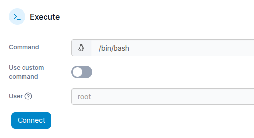

# Cara Menginstall dan Memasang Password di Node-Red

Node-Red adalah aplikasi visual programming yang belum saya coba secara serius.

Namun, karena gratis dan saya bisa menginstallnya di Raspberry Pi, saya jadi punya alasan kuat untuk menginstallnya.

## Menginstall Docker dan Portainer

Installasi Node-Red paling mudah melalui Docker, menurut saya.

Jadi, jika Anda belum menginstall Docker di Raspberry Pi, install saja dulu.

Setelah Docker terinstall, saya juga menganjurkan Anda untuk menginstall Portainer.

Portainer akan digunakan dalam praktek pemasangan password di Node-Red kali ini.

Itu karena, kita akan masuk ke terminal untuk container dari Node-Red tadi.

## Cara Menginstall Portainer

Untuk melakukan penginstallan Portainer, jalankan perintah ini:

```bash
docker volume create portainer_data
```

```bash
docker run -d -p 9000:9000 -p 9443:9443 --name portainer --restart=always -v /var/run/docker.sock:/var/run/docker.sock -v portainer_data:/data portainer/portainer-ce:2.21.5
```

Sekarang Anda bisa mengaksesnya di http://ip-raspberry-pi-anda:9000

## Sekarang Saya Berasumsi Bahwa Anda Telah Menginstall Docker dan Portainer

OK, kita akan melakukan docker run untuk Node-Red.

Pertama, buka terminal Raspberry Pi Anda.

Oh iya.. Untuk terminal Raspberry Pi kali ini, Anda bebas memilih dengan metoda ssh maupun vnc client.

Pada terminal Raspberry Pi Anda, jalankan perintah ini:

```bash
docker run -it -d -p 8100:1880 -v node_red_data:/data --name mynodered nodered/node-red
```

Jika tidak ada kesalahan, maka Node-Red siap digunakan di http://ip-raspberrypi-anda:8100

Jika aplikasi Node-Red terbuka, maka Anda akan masuk ke editornya tanpa ditanyai password.

Kita akan mengubah itu.

## Memasang Password Node-Red

Sekarang, buka portainer Anda yang telah terinstall di Raspberry Pi, login, kemudian menuju ke menu container.

Di container list, masuk ke mynodered dan klik Console di sebelah stats (ada di bagian atas) kemudian klik Connect.




Nanti jendela terminal akan muncul.


Jalankan:

```bash
nano /data/settings.js
```

File settings.js akan terbuka, kemudian uncomment bagian ini:

```javascript
adminAuth: {

... dan seterusnya sampai...

  permission: "*"
  }]
},
```

Selanjutnya, restart container mynodered.

Setelah di-restart dan masuk URL Node-Red tadi, Anda akan ditanyai username dan password.

Di container saya, default username dan passwordnya adalah "admin" dan "password".

Jika berhasil maka Anda bisa masuk.

## Akhir Kata

Sekian dan baca terus blog saya.