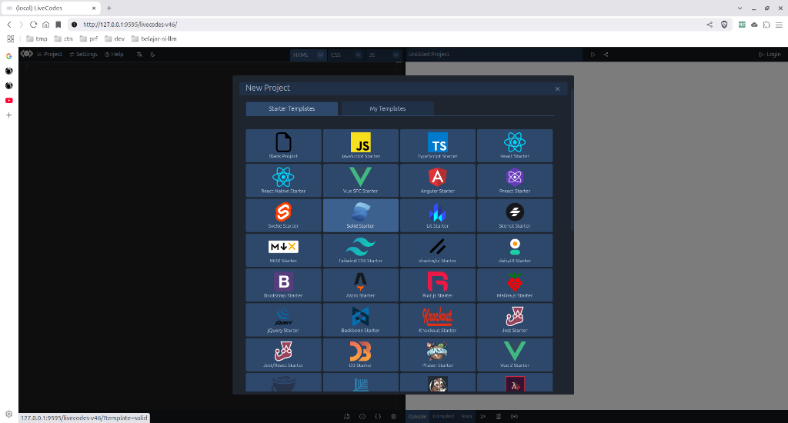
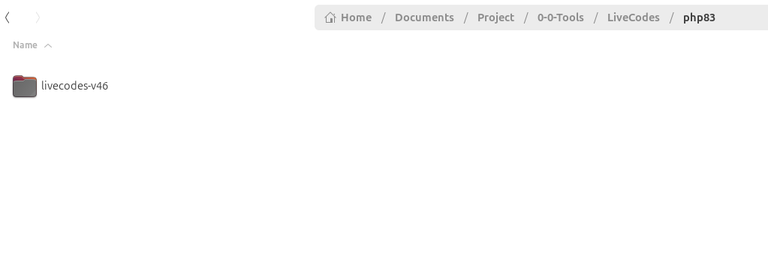
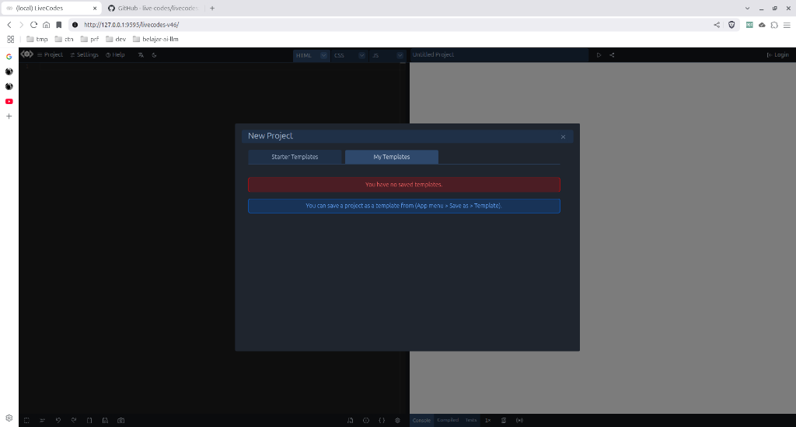
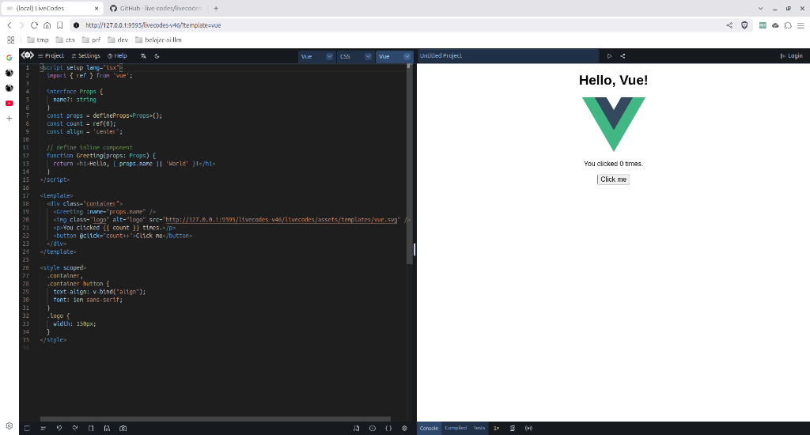

# Code Playground Komplit Self Hosted untuk Menjajal Kode Anda

Mencoba menjalankan kode bisa dilakukan dengan aplikasi code playground.

Aplikasi semacam itu memang dirancang untuk mencoba menjalankan kode.

Itu karena kita bisa langsung mencobanya tanpa melakukan setup pada bahasa pemrograman yang akan kita coba terlebih dahulu.

Pada umumnya, aplikasi code playground berbasis web dan dengan adanya docker, maka installasinya pun lebih mudah.

Salah satu aplikasi code playground yang bisa Anda gunakan adalah [Live Codes](https://github.com/live-codes/livecodes).

Aplikasi tersebut mendukung banyak bahasa dan framework.



Aplikasi tersebut bisa diinstall dengan mudah, yakni hanya cukup mendownload [zip release-nya](https://github.com/live-codes/livecodes/releases/download/v46/livecodes-v46.zip), mengekstraknya pada folder di web server Anda dan langsung menjalankannya.

Namun dalam artikel ini, saya mencoba untuk menginstallnya dengan Docker.

Pada prinsipnya, kita perlu menginstall web server dulu dengan Docker, kemudian mengekstrak zip tadi ke dalam folder web servernya.

## Persiapan

Karena saya ingin sekalian menginstall php (walaupun aplikasi Live Codes tidak memerlukan php), maka saya akan sekalian membahasnya sekaligus dengan penginstallan web servernya.

Sekarang, buat sebuah folder bernama LiveCodes di manapun Anda suka, kemudian masuklah ke dalamnya.

Selanjutnya, buat folder bernama php83.

Selanjutnya, buat file bernama Dockerfile-php83 dan isi dengan script ini:

```docker
FROM php:8.3-apache
RUN docker-php-ext-install pdo_mysql
RUN docker-php-ext-install mysqli
RUN apt update
RUN a2enmod rewrite
RUN apt-get install -y git
RUN apt-get install -y curl
RUN curl -s https://getcomposer.org/installer | php
RUN mv composer.phar /usr/local/bin/composer
RUN mkdir /var/www/html/php83
```

Selanjutnya, buat file bernama docker-compose.yml dan isi dengan script ini:

```yaml
version: '3.3'

services:
 php83:
  container_name: php83
  build:
   context: .
   dockerfile: Dockerfile-php83
  ports:
   - 9595:80
  volumes:
   - ./php83:/var/www/html/

volumes:
 db:
```

Selanjutnya, jalankan perintah ini:

```bash
docker compose up -d
```

Nanti, docker akan membuild Dockerfile-php83, karena dalam kasus ini kita tidak mem-pull-nya dari docker registry secara keseluruhan.

Hal tersebut bisa diverifikasi dengan adanya keyword build di kode docker-compose.yml tadi:

```yaml
build:
   context: .
   dockerfile: Dockerfile-php83
```

Setelah proses build selesai, maka container akan dibuat dan dijalankan.

## Memasukkan Script Live Codes ke dalam Folder Web Server

Sekarang, saya berasumsi bahwa Anda telah mendownload [zip dari LiveCodes](https://github.com/live-codes/livecodes/releases/download/v46/livecodes-v46.zip).

Ekstraklah dan masukkan folder hasil ekstraksinya ke dalam folder php83.

Itu karena folder /var/www/html di dalam volume docker di mount ke folder php83 yang ada di folder yang telah Anda buat di awal artikel ini.



Sekarang, Anda bisa langsung menuju ke http://ip-komputer-lokal-anda:9595 untuk menjalankannya.

Jika Anda menginstallnya di localhost, Anda bisa menuju ke [http://localhost:9595/livecodes-v46](http://localhost:9595/livecodes-v46) atau [http://127.0.0.1:9595/livecodes-v46](http://127.0.0.1:9595/livecodes-v46) 

Berikut ini tampilannya:





## Akhir Kata

Sekarang, Anda telah meng-install salah satu aplikasi yang sangat bermanfaat untuk menjajal kode Anda sendiri tanpa harus melakukan setup dari setiap framework yang akan Anda coba kodenya.

Sekian.