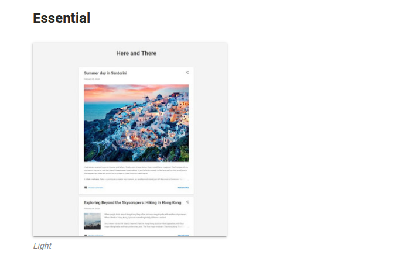
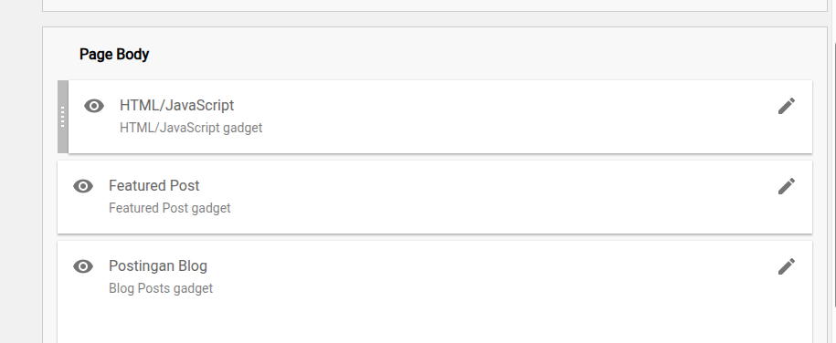
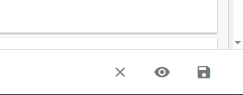
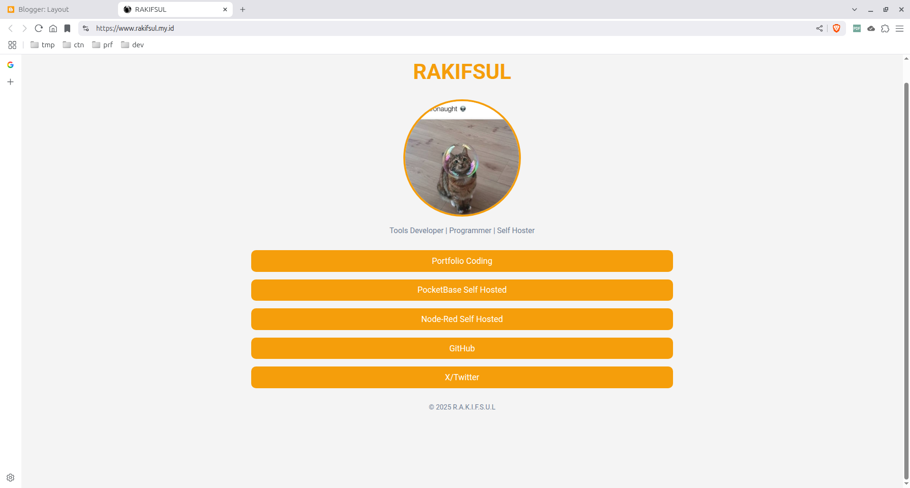

# Membuat Link in Bio Gratis dengan Subdomain tanpa Perlu Sewa Hosting

Link in bio memang bio yang berisi link..

Kategori website semacam ini menurut saya memang ditujukan bagi pengguna yang memiliki profil online secara tersebar.

Misalnya, user mungkin memiliki akun sosmed A, B, dan C, serta memiliki website 1, dan 2 dan lain sebagainya.

Salah satu jenis user semacam itu adalah content creator walaupun mungkin ada yang lain juga.

Sekarang, apapun profesi Anda, setidaknya membuat link in bio secara gratis dengan subdomain tanpa perlu sewa hosting tetap dibutuhkan.

Itu karena saya berasumsi bahwa hampir semua penghuni internet memang memiliki banyak profil online.

## Tapi Bagaimana Bisa?

Website link in bio gratis, ada subdomainnya (bahkan memungkinkan dengan custom domain), tanpa perlu sewa hosting? Itu terdengar tak masuk akal.

Sebenarnya tidak juga. Hal itu sangat masuk akal jika Anda mau berpandangan bahwa link in bio pada dasarnya adalah teks HTML, CSS, dan mungkin JavaScript. Jikalau ada gambar pun, gambar tersebut juga bisa berupa URL yang dimasukkan ke atribut src dari tag img.

Singkat kata, cara yang saya proposalkan adalah dengan menggunakan layanan blog gratis. Dan platform blog tersebut bernama Blogger.

Blogger adalah salah satu platform blog gratis yang memungkinkan banyak customization.

Maka tidak heran bahwa banyak sekali kreasi tampilan blog dari penggunanya.

Salah satu faktor penyebabnya adalah karena pengguna Blogger diberi akses untuk mendefinisikan widget dari blognya dan widget tersebut bisa mengandung HTML, CSS, dan JavaScript.

Dengan custom HTML, CSS, dan JavaScript tadi, maka bisa diverifikasi bahwa Blogger memang merupakan solusi gratis untuk link in bio yang saya maksudkan sejak tadi.

## Bagaimana Caranya?

Nah, ini yang menarik karena di sini kita akan praktek.

Pertama, pastikan Anda memiliki akun gmail. Jika belum, silakan daftar dulu.

Selanjutnya, kunjungi Blogger di sini:

[https://www.blogger.com/](https://www.blogger.com/)

Login dengan akun gmail Anda.

Selanjutnya, buatlah satu blog dengan nama subdomain dan nama blog sesuka Anda.

Namun, untuk mempermudah pembahasan, saya berasumsi nama blognya adalah "Profil Saya" dan nama subdomainnya adalah "profil-saya" yang artinya nama subdomain lengkapnya adalah "profil-saya.blogspot.com".

Masuklah ke dashboard dari "Profil Saya", kemudian klik menu "Theme".

Scroll ke bawah dan pilih template atau theme bernama "Light" dari kategori "Essential".



Saya memilih theme itu karena tidak memiliki sidebar dan cenderung menempati bagian tengah dari halaman web.

Apply template tadi, kemudian masuk ke menu "Layout".

Pilih section "Sidebar (Top)" kemudian klik "Add a Gadget".

Pada pilihan gadget, ambil yang bernama "HTML/JavaScript".

Edit Gadget Tersebut.

Isi content dari gadget tersebut dengan script ini:

```html
<style>
h1{
color: #F59E0B !important;
}
    .profile {
      text-align: center;
      margin-bottom: 2rem;
    }

    .avatar {
      width: 240px;
      height: 240px;
      border-radius: 50%;
      border: 4px solid #F59E0B;
      object-fit: cover;
      margin-bottom: 1rem;
    }

    .name {
      font-size: 1.5rem;
      font-weight: bold;
    }

    .bio {
      font-size: 1rem;
      color: #718096;
    }

    .links {
      width: 100%;
      display: flex;
      flex-direction: column;
      gap: 1rem;
    }

    .link-button {
      text-decoration: none;
      background: #F59E0B;
      color: white;
      padding: 0.8rem 1rem;
      border-radius: 10px;
      text-align: center;
      font-size: 1.1rem;
      transition: background 0.3s ease;
    }

    .link-button:hover, .link-button:visited {
color: white;
      background: #D97706;
    }

    footer {
      margin-top: 2rem;
      font-size: 0.9rem;
      color: #718096;
    }

.post-outer-container {
display: none !important;
}
  </style>


  <div class="profile">
    
    <div class="bio">Tools Developer | Programmer | Self Hoster</div>
  </div>

  <div class="links">
    <a href="https://rakifsul.github.io" class="link-button" target="_blank">Portfolio Coding</a>
    <a href="https://github.com/rakifsul" class="link-button" target="_blank" rel="nofollow">GitHub</a>
<a href="https://x.com/rakifsul" class="link-button" target="_blank" rel="nofollow">X/Twitter</a>
  </div>

  <footer style="text-align:center;">&copy; <span id="year"></span> R.A.K.I.F.S.U.L</footer>

  <script>
    // Auto update tahun di footer
    document.getElementById("year").textContent = new Date().getFullYear();
  </script>
```

Pastikan Anda tidak memberi judul atau title pada gadget tersebut dan juga pastikan bahwa "Show this widget" sudah di-enable.

Selanjutnya klik "Save".

Setelah itu, drag gadget atau widget yang telah Anda buat tadi ke bagian teratas dari section bernama "Page Body".



Selanjutnya, save layout dengan mengklik tombol "Save" di bagian kanan bawah layar.



Untuk melihat hasilnya, klik menu "View Blog" atau kunjungi https://profil-saya.blogspot.com (tergantung nama yang Anda pilih).

Hasil yang saya dapatkan semacam ini:



Jika Anda masih menemui widget-widget yang tersisa, Anda bisa menghapus atau men-disable-nya di menu "Layout".

Selain itu, link yang ada di script tadi masih belum saya edit, jadi mungkin ada link milik saya. Anda bisa mengubahnya sendiri. Jika belum bisa, maka Anda harus belajar HTML, CSS, dan JavaScript sendiri, karena saya tidak membahasnya di sini.

## Benarkah Bisa Custom Domain?

Sejauh ini, saya telah mencoba menerapkan domain custom saya pada blog saya tadi dan berhasil.

Sebenarnya caranya juga tidak terlalu sulit, tapi saya memilih untuk tidak membahasnya karena domain tadi harus dibeli dan tampilan DNS management itu berbeda-beda tergantung hosting yang Anda pilih.

Selain itu, untuk bisa diakses, terkadang memasang custom domain membutuhkan waktu yang sedikit lama.

## Akhir Kata

Setidaknya sekarang anda punya link in bio gratis dengan subdomain.

Dan karena didukung platform besar seperti Blogger, maka seharusnya kecepatan loading-nya juga bagus.

Selesai.